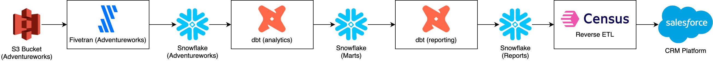

# modern-data-platform



## Set up 

Create the following accounts: 
- [Fivetran](https://fivetran.com/)
- [Snowflake](https://app.snowflake.com)
- [Census](https://app.getcensus.com/)

Create environment variable file `.env` in `dagster/data-platform/`

```
FIVETRAN_API_KEY=<TODO>
FIVETRAN_API_SECRET=<TODO>
SNOWFLAKE_USERNAME=<TODO>
SNOWFLAKE_PASSWORD=<TODO>
CENSUS_API_KEY=<TODO>
```

# Run the app 

If you only want to view asset lineage: 
```
cd dagster/data-platform
dagster-webserver
```

Otherwise, to run dagster web-server with the scheduler, run: 
```
cd dagster/data-platform
dagster dev
```

# Demo 

1. Inferred Asset DAG
    - Show import code for Fivetran and dbt. 
    - No need to manually generate a DAG.
    - Dependencies are inferred using dbt's graph (source/ref).
    - Asset level dependencies, and not Project level dependencies. 
    - Compare this approach to Argo/Airflow approach. You have to explicitly define your upstream dependencies, and on the Project level. 
    - Asset tests are displayed on each asset
2. Create custom assets (e.g. Census)
    - We have plenty of use-cases that we don't have built-in asset connectors for e.g. Experiments, ML Pipelines, Census, etc. 
    - We can create our own custom asset connectors that read data from APIs or code locations, and create the necessary assets. 
3. Policy based scheduling
    - Uses Policies (aka conditions) to trigger asset refresh. 
    - Policies can be defined in the same place that Analytics Engineers and Data Scientist contribute code i.e. dbt projects. 
    - Built-in policy types:
        - Eager
            - Let's see this in action. 
                ```YML
                models:
                    +meta:
                        dagster:
                        group: dbt_reporting
                        auto_materialize_policy:
                            type: "eager"
                ```
            - What problem does it create? Over-syncing -- perhaps we don't need that table to be SUPER fresh. It's fine to have some delays in refreshing (i.e. allow for an evaluation period of 30 minutes). 
        - on_cron: Different schedule cadences e.g. monthly, weekly, daily, hourly
        - on_missing
        - See: https://docs.dagster.io/concepts/automation/declarative-automation#automation-conditions
    - If any of the above built-in policy types don't suffice for your use-case, you can create your own custom policies, see: https://docs.dagster.io/concepts/automation/declarative-automation/customizing-automation-conditions. The link contains building blocks to create an assortment of custom automation policies based on different conditions.
4. Asset Catalog - comparable to the Atlan data catalog
    - Column metadata
    - Owners
    - Tags
    - Lineage
    - Execution history (++) - We don't have this information in Atlan. 
        - You can drill into all historical runs for a given asset.
        - (We don't need to build this in Mode!)
    - Execution runtime trend analysis (Plots) - Easily see spikes in runtime duration
        - (We don't need to build this in Mode!)

Everything else you'd expect from an orchestrator: 

5. Retries and continue from failed step
6. Partitions and backfills
    - Tracks partition state in an dagster internal database (postgresql).
    - Fires of parallel sub-processes (or pods in k8s) for each partition. 
7. Back to primitive methods for scheduling - Explicit Jobs and Job Schedule per dbt project (similar to Cronjobs, Airflow and Argo)
    - Different schedule cadences e.g. monthly, weekly, daily, hourly
8. Monitoring and alerting (run view) - compare that to dashboards we've built in Mode (already went through this)
